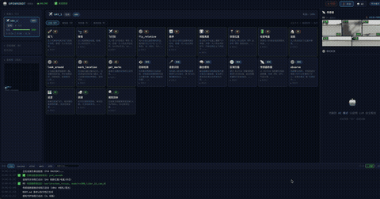
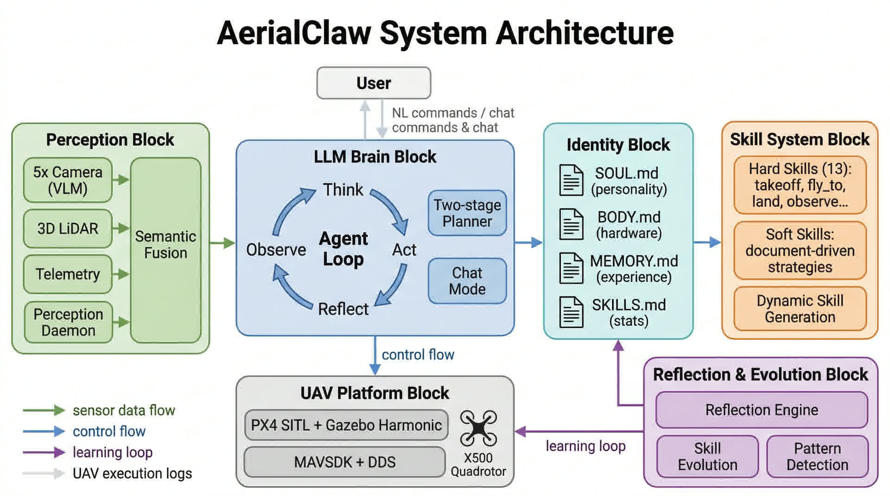
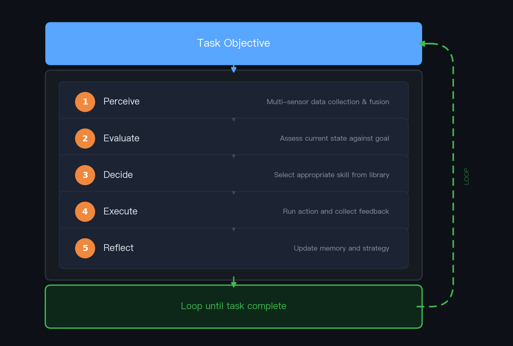
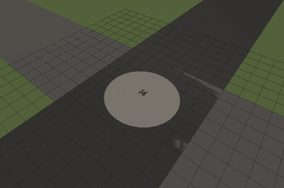
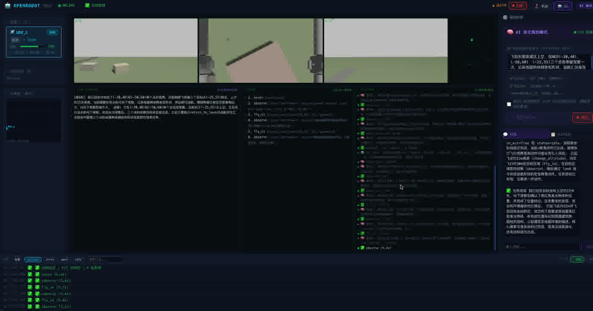

# 🦅 AerialClaw: Towards Personal AI Agents for General Autonomous Aerial Systems


<p>
  
  
  
  
  
</p>

**English** | [中文](README_CN.md)

**AerialClaw** is a personal AI agent framework for general autonomous aerial systems. The system provides a standardized library of atomic action skills (takeoff, navigation, perception, etc.), with an LLM performing real-time environmental perception, decision planning, and skill composition during task execution — eliminating the need to pre-script complete flight procedures for each mission, while endowing each drone with its own identity, task memory, and skill evolution capability.

Developed by ROBOTY Lab, School of Computer Science, Xidian University, the project builds on the design philosophy of [OpenClaw](https://github.com/openclaw/openclaw), using Markdown documents to define and maintain each agent's cognitive state and capability boundaries, autonomously read and written by the model — making every drone truly "personal" with its own experience, preferences, and growth trajectory.

> *"No pre-scripted procedures, just defined capabilities — let every drone think, learn, and grow through its own missions."*

<p align="center">
  
</p>

---

## Research Background and Motivation

Current drone systems primarily operate through pre-programming or remote control, requiring specific control scripts for different scenarios. They often lack adaptability to unknown environments and mechanisms for accumulating task experience.

AerialClaw explores an alternative technical approach: **Endowing drones with autonomous environmental understanding and decision-making capabilities through LLMs**.

- 🧠 **Reasoning rather than mere execution** — LLM models parse task objectives and generate step-by-step decision sequences
- 👁️ **Semantic-level environmental understanding** — Converting multi-source sensor data into natural language descriptions to support commonsense-based reasoning
- 📝 **Flight experience accumulation** — Establishing a task memory repository to support decision optimization based on historical experience
- 🪪 **Capability boundary awareness** — Maintaining system performance profiles, recording capability boundaries and historical performance

| | Traditional Drone | AerialClaw Drone |
|:---|:---|:---|
| **Task Input** | "Execute waypoint list" | "Search this area for survivors" |
| **On Failure** | Hover or crash | Analyze cause, retry with new strategy |
| **New Mission** | Rewrite code | A natural language instruction |
| **Experience** | Every flight starts from scratch | Every flight accumulates experience |

## System Architecture Design

<p align="center">
  
</p>

### From OpenClaw to AerialClaw: Research Evolution

The [OpenClaw](https://github.com/openclaw/openclaw) project validated the effectiveness of identity documents and memory reflection mechanisms in conversational agents. AerialClaw builds upon this foundation to further explore: **Can this framework be applied to autonomous mobile platforms with physical constraints?**

| Dimension | OpenClaw (Conversational Agent) | AerialClaw (Autonomous Drone) |
|---|---|---|
| Identity Definition | SOUL.md → Dialogue style | SOUL.md → Flight strategy preferences |
| Memory System | Dialogue history records | MEMORY.md → Task experience repository |
| Skill Implementation | API calls and text processing | Physical action execution and environmental interaction |
| Interaction Mode | Responding to user input | Autonomous perception-decision cycle |
| Learning Mechanism | Learning from dialogue | Learning from flight experience |

### Core Design Principles

1. **First-person decision perspective** — The system adopts the drone's perspective for decision expression
2. **Semantic-level sensor fusion** — Converting raw sensor data into semantic descriptions understandable by LLMs
3. **Document-driven skill definition** — Flight actions and strategies stored as readable documents, supporting dynamic loading
4. **Hierarchical memory management** — Efficient balancing between long-term experience accumulation and short-term context

## Decision Mechanism: Autonomous Loop Implementation

The system employs an incremental decision mechanism based on real-time perception, executing a complete cognitive cycle at each step:

<p align="center">
  
</p>

The system possesses basic exception handling capabilities: path replanning when obstructed, attention adjustment when discovering unexpected targets, and automatic return when battery is low.

### Identity and State Management System

| Document | Functional Description | Content Example |
|----------|-----------------------|-----------------|
| `SOUL.md` | Defines decision preferences and constraints | *Safety-first strategy, conservative risk assessment* |
| `BODY.md` | Records hardware configuration and performance parameters | *Sensor types, flight performance boundaries* |
| `MEMORY.md` | Stores task experience and lessons learned | *Effective strategy records for specific scenarios* |
| `SKILLS.md` | Tracks skill execution statistics | *Success rates and applicable conditions for actions* |
| `WORLD_MAP.md` | Builds environmental feature knowledge base | *Landmarks and risk points in known areas* |

All documents use Markdown format, supporting version management and manual review. The system automatically reads and writes relevant documents before and after tasks.

### Integrated Skill System

The system uses a **Hard Skills + Soft Skills** two-tier architecture. Hard skills are atomic actions that directly control the drone; soft skills are high-level strategies that the LLM executes by reading documentation and autonomously composing hard skills.

**Hard Skills (12 Atomic Actions)**:

| Category | Skills | Description |
|:---|:---|:---|
| Flight Control | `takeoff` `land` `hover` `fly_to` `fly_relative` `change_altitude` `return_to_launch` | Takeoff/landing, hover, point-to-point flight, relative movement, altitude change, RTL |
| Perception | `look_around` `detect_object` `fuse_perception` | Multi-directional observation, object detection (VLM), multi-sensor semantic fusion |
| Status Query | `get_position` `get_battery` | Current position and battery status |
| Markers | `mark_location` `get_marks` | Mark points of interest, query marked locations |

**Soft Skills (Strategy Documents)**:

| Strategy | Description |
|:---|:---|
| `search_target` | Area search — LLM autonomously plans search paths, fuses vision and LiDAR to identify targets |
| `rescue_person` | Personnel rescue — Full workflow from approach, assessment, marking to reporting |
| `patrol_area` | Area patrol — Strategic area coverage with continuous anomaly monitoring |

Soft skills are stored as Markdown documents. During execution, the LLM reads these documents to understand strategic intent and autonomously composes hard skills to complete tasks. The system also supports **dynamic soft skill generation**: when the LLM identifies recurring behavior patterns during reflection, it automatically extracts them into new strategy documents. We are also exploring the use of a **Skill Network to model soft skill composition and scheduling**, evolving strategy selection from pure LLM reasoning toward a learnable, optimizable decision network. Looking further ahead, we aim to decouple AerialClaw's core architecture into a **general-purpose framework for intelligent devices** — through a standardized protocol adaptation layer, any hardware with sensing and actuation capabilities could gain the same autonomous intelligence.

### Perception System

Skill execution depends on environmental awareness. The system adopts a **passive + active dual-layer perception architecture**, providing the LLM with environmental information at different granularities:

- **Passive perception** (`PerceptionDaemon`) — Runs continuously in the background, periodically fusing multi-sensor data into environmental summaries for real-time situational awareness
- **Active perception** (`VLMAnalyzer`) — Triggered on-demand by the LLM, invoking vision-language models for deep image analysis (object detection, scene understanding, etc.)

Perception models are **plug-and-play configurable**: connect to cloud APIs (GPT-4o, etc.), locally deployed open-source models, or custom fine-tuned models — adapting to different deployment scenarios' requirements for latency, accuracy, and privacy.

This design supports research across various application scenarios:
- 🏚️ **Disaster Response** — Personnel search and rescue in rubble environments
- 🌲 **Ecological Monitoring** — Anomaly detection in forested areas
- 🏗️ **Facility Inspection** — Safety inspection of building structures
- 🌾 **Agricultural Observation** — Assessment of crop growth status

## Simulation Verification Environment

Currently implemented in a **PX4 SITL + Gazebo Harmonic** simulation environment:

<p align="center">
  
  <br>
  <em>Simulation testing of X500 drone in urban rescue scenario (4x speed playback)</em>
</p>

| Component | Technical Choice |
|-----------|------------------|
| Flight Control System | PX4 v1.15 Software-in-the-Loop |
| Simulation Environment | Gazebo Harmonic (gz sim 8.x) |
| Sensor Models | 5 cameras + 3D LiDAR (360°×16 layers) |
| Communication Protocol | Micro XRCE-DDS + MAVSDK gRPC |
| Coordinate System | NED (North-East-Down) local coordinate system |

**Simulation Scene Elements**: Collapsed buildings, trapped person models, fire and smoke effects, obstacle arrangements, ground markings, etc.

## Web Monitoring Interface

<p align="center">
  
</p>

Provides necessary visualization and interaction tools for research:
- 📷 **Multi-view Video**  — Real-time feeds from front/back/left/right/down cameras
- 📡 **LiDAR Visualization** — Multi-layer rendering of 3D LiDAR point cloud data
- 🕹️ **Manual Control**     — First-person view with keyboard flight control
- 🤖 **AI Autonomous Mode** — Natural language tasking with LLM-driven execution
- 💬 **Command Interface**  — Natural language task commands and dialogue
- 📊 **Status Monitoring**  — Real-time flight parameters and system status
- ⚙️ **Model Configuration** — Switch and configure multiple LLM backends

The system supports **real-time Manual / AI mode switching**, allowing operators to take over control from AI autonomous mode at any time, with one-click execution interruption. This is the fundamental safety guarantee for real-world deployment — AI handles the decisions, but humans always retain the final override.

## Installation and Deployment

### Environment Requirements

- Python >= 3.10, Node.js >= 18
- [PX4 Autopilot](https://docs.px4.io/main/en/dev_setup/building_px4.html) v1.15+
- [Gazebo Harmonic](https://gazebosim.org/docs/harmonic/install)
- [Micro XRCE-DDS Agent](https://github.com/eProsima/Micro-XRCE-DDS-Agent)
- MAVSDK-Python (`pip install mavsdk`)

### Installation Steps

```bash
# Clone the repository
git clone https://github.com/XDEI-Group/AerialClaw.git
cd AerialClaw

# Configure Python environment
python3 -m venv venv
source venv/bin/activate
pip install -r requirements.txt

# Build the web interface
cd ui
npm install
npm run build
cd ..
```

### LLM Service Configuration

Modify the `config.py` configuration file:

```python
ACTIVE_PROVIDER = "ollama_local"   # Local model service
# ACTIVE_PROVIDER = "openai"       # OpenAI compatible API
MODULE_CONFIG["vlm"]["provider"] = "gpt4o_vlm"  # Visual understanding model
```

## Quick Start

```bash
# Start simulation environment
./scripts/start_gz_sim.sh urban_rescue

# Start MAVSDK service
mavsdk_server -p 50051 udp://:14540

# Start AerialClaw main service
python server.py

# Access web interface
# http://localhost:8000
```

Test system functionality with natural language commands:
- *"Take off to 15 meters altitude and observe the environment"*
- *"Search for anomalies in the area"*
- *"Report current battery status"*

## Project Structure

```
AerialClaw/
├── brain/                    # Core decision-making modules
├── perception/               # Perception processing modules
├── skills/                   # Skill library
│   ├── hard_skills.py        # Basic action implementations
│   ├── docs/                 # Skill documents
│   └── soft_docs/            # Scenario strategy documents
├── memory/                   # Memory and learning modules
├── robot_profile/            # State configuration files
├── adapters/                 # Hardware adaptation layer
├── sim/                      # Simulation interfaces
├── ui/                       # Web interface
├── server.py                 # Service entry point
└── config.py                 # Configuration files
```

## Research Progress and Plans

### Implemented Features
- [x] Autonomous decision-making cycle framework
- [x] Identity and state management system
- [x] Basic flight action skill library
- [x] Multi-sensor semantic fusion interface
- [x] Experience accumulation and reflection mechanism
- [x] PX4+Gazebo simulation integration
- [x] Web monitoring and interaction interface

### Current Focus
- [ ] Performance evaluation in complex scenarios
- [ ] Stability testing for long-term autonomous missions
- [ ] Quantitative analysis of decision-making effectiveness

### Future Research Directions
- [ ] Porting verification to real drone platforms
- [ ] Integration solutions with ROS2 framework
- [ ] Simulation-to-reality transfer learning
- [ ] Exploration of multi-agent collaboration mechanisms
- [ ] General device framework — standardized protocol adapters for diverse embedded hardware
- [ ] Safety decision boundaries — action compliance verification, geofencing, and flight envelope constraints for LLM outputs

## Contribution

Researchers in related fields are welcome to participate:
- **Scenario and Task Design** — Expanding test scenarios and evaluation tasks
- **Perception Algorithm Improvement** — Optimizing sensor data processing and fusion
- **Platform Adaptation Extension** — Supporting more drone hardware platforms
- **Evaluation Benchmark Establishment** — Designing scientific performance evaluation systems

## License

This project is licensed under the [MIT License](LICENSE).

## Acknowledgements

The research approach of AerialClaw was inspired by the [OpenClaw](https://github.com/openclaw/openclaw) project, for which we express our gratitude.

The project is built upon the following open source technologies:
[PX4](https://px4.io/) · [Gazebo](https://gazebosim.org/) · [MAVSDK](https://mavsdk.mavlink.io/) · [React](https://react.dev/) · [Vite](https://vitejs.dev/)

---

*This project is an academic research-oriented open source initiative aimed at exploring the application potential of LLMs in autonomous mobile platforms.*