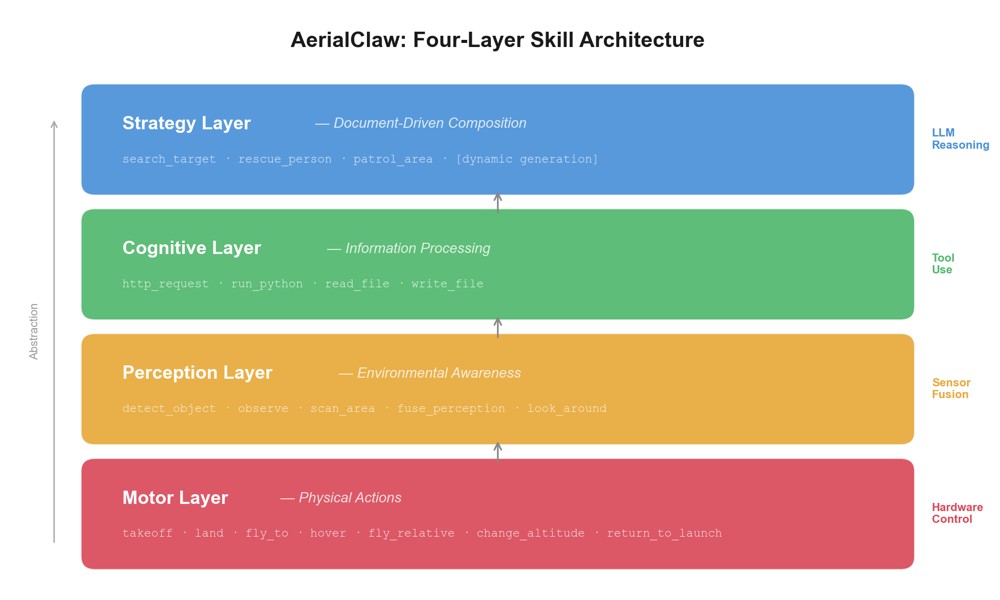

# 🦅 AerialClaw: Towards Personal AI Agents for General Autonomous Aerial Systems


<p>
  
  
  
  
  
  
</p>

**English** | [中文](README_CN.md)

**AerialClaw** is a personal AI agent framework for general autonomous aerial systems. The system provides a standardized library of atomic action skills (takeoff, navigation, perception, etc.), with an LLM performing real-time environmental perception, decision planning, and skill composition during task execution — eliminating the need to pre-script complete flight procedures for each mission, while endowing each drone with its own identity, task memory, and skill evolution capability.

The project uses Markdown documents to define and maintain each agent's cognitive state and capability boundaries, autonomously read and written by the model — making every drone truly "personal" with its own experience, preferences, and growth trajectory.

> *"No pre-scripted procedures, just defined capabilities — let every drone think, learn, and grow through its own missions."*

<p align="center">
  
</p>

---
---
---

## 📢 Update

- **(2026/5/12)** PX4+Gazebo Web console maintenance update — restored Gazebo camera/LiDAR streaming for the Web UI, added a Gazebo direct demo adapter for local simulation control, fixed cockpit velocity and telemetry synchronization issues, prevented LLM parsing failures from being reported as successful missions, added deterministic fallback plans for simple commands when the LLM channel is unavailable, and made runtime LLM provider/model settings persistent with safe user-facing error messages.
- **(2026/3/24)** AerialClaw v2.0 updated — safety envelope, four-layer memory, universal device protocol, self-evolution engine, AirSim Shanghai city scene, autonomous city patrol demo, GPT-4o vision perception, real-time map update, Doctor agent adapter, WASD manual control, smooth interpolated flight.
- **(2026/3/14)** AerialClaw v1.0 released — full agent loop, 12 hard skills, reflection engine, Web UI, PX4+Gazebo simulation.


## 📑 Table of Contents

- [Motivation](#motivation)
- [System Architecture Design](#system-architecture-design)
- [Decision Mechanism](#decision-mechanism-autonomous-loop-implementation)
- [Skill System](#integrated-skill-system)
- [Perception System](#perception-system)
- [Simulation Environment](#simulation-demo-environment)
- [Web Monitoring Interface](#web-monitoring-interface)
- [Installation and Deployment](#installation-and-deployment)
- [Quick Start](#quick-start)
- [Project Structure](#project-structure)
- [Acknowledgements](#acknowledgements)

## Motivation

Current drone systems mostly rely on pre-programmed scripts, lacking adaptability to unknown environments. AerialClaw explores endowing drones with **autonomous environmental understanding and real-time decision-making** through LLMs:

- 🧠 **Reasoning, not just execution** — LLM parses task objectives and generates step-by-step decisions
- 👁️ **Semantic-level understanding** — Multi-source sensor data converted to natural language for commonsense reasoning
- 📝 **Flight experience accumulation** — Task memory repository for history-based decision optimization
- 🪪 **Capability boundary awareness** — Performance profiles tracking capability boundaries

## System Architecture Design

<p align="center">
  
</p>

### Core Design Principles

1. **First-person decision perspective** — Drone's own perspective for decision-making
2. **Semantic-level sensor fusion** — Raw sensor data converted to LLM-understandable descriptions
3. **Document-driven skill definition** — Actions and strategies as readable documents, dynamically loaded
4. **Hierarchical memory management** — Long-term experience and short-term context balanced efficiently

## Decision Mechanism: Autonomous Loop Implementation

The system employs an incremental decision mechanism based on real-time perception, executing a complete cognitive cycle at each step:

<p align="center">
  
</p>

The system possesses basic exception handling capabilities: path replanning when obstructed, attention adjustment when discovering unexpected targets, and automatic return when battery is low.

### Identity and State Management System

| Document | Functional Description | Content Example |
|----------|-----------------------|-----------------|
| `robot_profile/SOUL.md` | Defines decision preferences and constraints | *Safety-first strategy, conservative risk assessment* |
| `robot_profile/BODY.md` | Records hardware configuration and performance parameters | *Sensor types, flight performance boundaries* |
| `robot_profile/WORLD_MAP.md` | Builds environmental feature knowledge base | *Landmarks and risk points in known areas* |

Runtime experience and skill-statistics files are generated during experiments and intentionally excluded from the public repository. This keeps the repository package clean while preserving the mechanism that can create those files locally.

### Integrated Skill System

The system uses a **two-layer skill architecture** — hard skills handle all atomic operations, soft skills provide strategic composition:

<p align="center">
  
</p>

**Hard Skills (16 Atomic Operations)** — All directly executable actions:

| Category | Skills | Description |
|:---|:---|:---|
| Flight Control | `takeoff` `land` `hover` `fly_to` `fly_relative` `change_altitude` `return_to_launch` | Takeoff/landing, hover, point-to-point flight, relative movement, altitude change, RTL |
| Perception | `look_around` `detect_object` `fuse_perception` | Multi-directional observation, object detection (VLM), multi-sensor semantic fusion |
| Status Query | `get_position` `get_battery` | Current position and battery status |
| Markers | `mark_location` `get_marks` | Mark points of interest, query marked locations |
| Computation | `run_python` `http_request` `read_file` `write_file` | Sandboxed code execution, HTTP requests, file I/O |

Hard skills include both physical drone control and information processing capabilities — e.g., checking weather APIs before deciding flight paths, or computing optimal routes using Python. All hard skills have built-in safety mechanisms: `run_python` runs in auto-degrading sandbox (Docker → subprocess → restricted), `http_request` blocks internal network with enforced timeout, file operations are restricted to working directory with audit logging.

**Soft Skills (Strategy Documents)**:

| Strategy | Description |
|:---|:---|
| `search_target` | Area search — LLM autonomously plans search paths, fuses vision and LiDAR to identify targets |
| `rescue_person` | Personnel rescue — Full workflow from approach, assessment, marking to reporting |
| `patrol_area` | Area patrol — Strategic area coverage with continuous anomaly monitoring |

Soft skills are stored as Markdown documents. During execution, the LLM reads these documents to understand strategic intent and autonomously composes motor, cognitive, and perception skills to complete tasks. The system also supports **dynamic soft skill generation**: when the LLM identifies recurring behavior patterns during reflection, it automatically extracts them into new strategy documents.

We are also exploring the use of a **Skill Network to model soft skill composition and scheduling**, evolving strategy selection from pure LLM reasoning toward a learnable, optimizable decision network. Looking further ahead, we aim to decouple AerialClaw's core architecture into a **general-purpose framework for intelligent devices** — through a standardized protocol adaptation layer, any hardware with sensing and actuation capabilities could gain the same autonomous intelligence.

### Perception System

Skill execution depends on environmental awareness. The system adopts a **passive + active dual-layer perception architecture**, providing the LLM with environmental information at different granularities:

- **Passive perception** (`PerceptionDaemon`) — Runs continuously in the background, periodically fusing multi-sensor data into environmental summaries for real-time situational awareness
- **Active perception** (`VLMAnalyzer`) — Triggered on-demand by the LLM, invoking vision-language models for deep image analysis (object detection, scene understanding, etc.)

Perception models are **plug-and-play configurable**: connect to cloud APIs (GPT-4o, etc.), locally deployed open-source models, or custom fine-tuned models — adapting to different deployment scenarios' requirements for latency, accuracy, and privacy.

This design supports research across various application scenarios:
- 🏚️ **Disaster Response** — Personnel search and rescue in rubble environments
- 🌲 **Ecological Monitoring** — Anomaly detection in forested areas
- 🏗️ **Facility Inspection** — Safety inspection of building structures
- 🌾 **Agricultural Observation** — Assessment of crop growth status

## Simulation Demo Environment

Currently verified in **AirSim + OpenFly** simulation environment (Shanghai urban scene):

<p align="center">
  
  <br>
  <em>Autonomous flight in Shanghai urban scene — AI-driven navigation through high-rise buildings with real-time perception</em>
</p>

| Component | Technical Choice |
|-----------|------------------|
| Flight Control System | AirSim SimpleFlight (API-based control) |
| Simulation Environment | Unreal Engine 4 + OpenFly AirSim (Shanghai urban scene) |
| Sensor Models | Front camera + simulated LiDAR (360°) |
| LLM / VLM | GPT-4o (planning, perception, report generation) |
| Communication Protocol | AirSim RPC (pure-socket msgpack) |
| Coordinate System | NED (North-East-Down) local coordinate system |

**Simulation Scene Elements**: High-rise commercial district, mid-rise residential blocks, low-rise buildings, urban roads, open areas for takeoff/landing.

## Web Monitoring Interface

<p align="center">
  
</p>

Provides necessary visualization and interaction tools for research:
- 📷 **Multi-view Video**  — Real-time feeds from front/back/left/right/down cameras
- 📡 **LiDAR Visualization** — Multi-layer rendering of 3D LiDAR point cloud data
- 🕹️ **Manual Control**     — First-person view with keyboard flight control
- 🤖 **AI Autonomous Mode** — Natural language tasking with LLM-driven execution
- 💬 **Command Interface**  — Natural language task commands and dialogue
- 📊 **Status Monitoring**  — Real-time flight parameters and system status
- ⚙️ **Model Configuration** — Switch and configure multiple LLM backends

The system supports **real-time Manual / AI mode switching**, allowing operators to take over control from AI autonomous mode at any time, with one-click execution interruption. This is the fundamental safety guarantee for real-world deployment — AI handles the decisions, but humans always retain the final override.

## Installation and Deployment

AerialClaw has three runnable paths. Start with Docker mock mode if you are a user or first-time user; then use local mock mode for development; finally use the PX4/Gazebo path when you want the full simulator.

### Path 1 — Docker mock mode (recommended first run)

This path is the fastest repeatable demo. It does **not** require PX4, Gazebo, AirSim, a GPU, a real drone, or an LLM API key.

```bash
git clone https://github.com/XDEI-Group/AerialClaw.git
cd AerialClaw

# Option A: Docker Compose
# Windows users: start Docker Desktop first and wait until the Linux engine is running.
docker compose up --build

# Option B: plain Docker
docker build -t aerialclaw:demo .
docker run --rm -p 5001:5001 aerialclaw:demo
```

Verify in another terminal:

```bash
curl http://localhost:5001/api/status
# Open http://localhost:5001
```

Expected response contains fields similar to:

```json
{"initialized": true, "mode": "manual", "current_robot": "HOST_DEVICE"}
```

The Docker image intentionally uses `requirements-mock.txt`, so it is a lightweight user image rather than a full PX4/Gazebo/AirSim image.

If Docker fails while loading metadata for `python:3.12-slim` or `node:22-slim`, for example with `TLS handshake timeout` from a registry mirror such as `registry.docker-cn.com`, fix the Docker Desktop registry/proxy settings first and then rerun `docker compose up --build`. `docker run aerialclaw:demo` only works after the image has been built successfully.

### Path 2 — Local mock mode (development)

Use this when editing code locally without the simulator.

```bash
git clone https://github.com/XDEI-Group/AerialClaw.git
cd AerialClaw

python3 -m venv venv
source venv/bin/activate
pip install -r requirements.txt

cd ui
npm install
npm run build
cd ..

# macOS / Linux
SIM_ADAPTER=mock python server.py

# Windows PowerShell
$env:SIM_ADAPTER="mock"; python server.py

# Windows CMD
set SIM_ADAPTER=mock
python server.py
```

Verify:

```bash
curl http://localhost:5001/api/status
# Open http://localhost:5001
```

Optional local gate before submitting changes:

```bash
bash scripts/smoke_mock.sh
```

### Path 3 — PX4 + Gazebo guided simulation

Use this after Path 1 or Path 2 works. This path is heavier because PX4 SITL and Gazebo are OS-level simulator dependencies. The repository provides a guided doctor/setup/start flow so you do not need to guess paths manually.

Prerequisites:

- Python >= 3.10, Node.js >= 18
- Git and CMake >= 3.22
- Gazebo Harmonic CLI (`gz`)
- Enough time for a first PX4 build, usually 10-30 minutes depending on the machine

```bash
# 1) Read-only diagnosis. It explains what is missing and the next command.
./scripts/doctor_gazebo.sh urban_rescue x500_lidar_2d_cam

# 2) First-time setup. This clones/builds PX4 and installs AerialClaw worlds/models.
./scripts/setup_px4.sh

# 3) Start DDS Agent + Gazebo + PX4 SITL. Keep this terminal open.
./scripts/start_sim.sh urban_rescue x500_lidar_2d_cam
```

In another terminal, start AerialClaw against PX4/Gazebo:

```bash
source venv/bin/activate  # if using a virtual environment
SIM_ADAPTER=px4 PX4_GZ_WORLD=urban_rescue PX4_SIM_MODEL=x500_lidar_2d_cam python server.py
```

Verify:

```bash
curl http://localhost:5001/api/status
curl http://localhost:5001/api/sensor/status
./scripts/doctor_gazebo.sh urban_rescue x500_lidar_2d_cam --live
# Open http://localhost:5001
```

If the bundled sensor model cannot be resolved on your machine, use the PX4 standard fallback:

```bash
./scripts/start_sim.sh default x500
SIM_ADAPTER=px4 PX4_GZ_WORLD=default PX4_SIM_MODEL=x500 python server.py
```

Common logs printed by the launcher:

```text
/tmp/aerialclaw_dds.log
/tmp/aerialclaw_gz.log
/tmp/aerialclaw_px4.log
```

For manual simulator debugging, see [docs/SIMULATION_SETUP.md](docs/SIMULATION_SETUP.md).

### Optional LLM configuration

Mock mode and the basic Web console can run without an LLM API key. For autonomous natural-language planning, copy `.env.example` to `.env` and configure an OpenAI-compatible provider:

```bash
cp .env.example .env
# edit ACTIVE_PROVIDER, LLM_BASE_URL, LLM_API_KEY, LLM_MODEL
```

Supports OpenAI, DeepSeek, Moonshot, local Ollama, or any OpenAI-compatible API. See [docs/LLM_CONFIG.md](docs/LLM_CONFIG.md) for details.

## Quick Start

After starting either Docker mock, local mock, or PX4/Gazebo mode, open:

```text
http://localhost:5001
```

In the Web UI:
1. Click "⚡ Initialize System"
2. Switch to "🤖 AI" mode (top right) when an LLM is configured, or use manual/mock controls for smoke testing
3. Try commands such as:
   - *"Take off to 15 meters and observe the surroundings"*
   - *"Search the northern area, photograph any targets found"*
   - *"Report current battery and position"*

## Project Structure

```
AerialClaw/
├── server.py                    # Service entry point (REST + WebSocket)
├── config.py                    # Global config (reads from .env)
├── llm_client.py                # Multi-provider LLM client
├── requirements.txt             # Python dependencies
│
├── brain/                       # Cognitive decision layer
│   ├── agent_loop.py            #   Autonomous decision loop
│   ├── planner_agent.py         #   LLM task planner (memory-aware)
│   └── chat_mode.py             #   Conversational mode
│
├── core/                        # Core systems
│   ├── errors.py                #   Exception classes + fix hints
│   └── logger.py                #   Color terminal + 7-day file rotation
│
├── perception/                  # Perception system
│   ├── daemon.py                #   Passive perception daemon
│   ├── passive_perception.py    #   Background sensor fusion
│   ├── vlm_analyzer.py          #   Active visual analysis (cloud VLM)
│   ├── prompts.py               #   Perception prompts
│   └── gz_camera.py             #   Gazebo camera bridge
│
├── skills/                      # Two-layer skill architecture
│   ├── motor_skills.py          #   Hard skills: flight control, perception, status
│   ├── perception_skills.py     #   Hard skills: detect, observe, scan
│   ├── cognitive_skills.py      #   Hard skills: run_python, http_request, file I/O
│   ├── observe_skill.py         #   Hard skills: multi-direction observation
│   ├── soft_skill_manager.py    #   Strategy layer: document-driven composition
│   ├── soft_docs/               #   Soft skill strategy documents (Markdown)
│   ├── registry.py              #   Skill registry (plug-and-play)
│   ├── skill_loader.py          #   Dynamic skill loading
│   ├── dynamic_skill_gen.py     #   Runtime skill generation
│   └── docs/                    #   Skill documentation
│
├── memory/                      # Four-layer memory system
│   ├── memory_manager.py        #   Memory orchestrator
│   ├── episodic_memory.py       #   Episodic memory (task history)
│   ├── skill_memory.py          #   Skill memory (execution stats)
│   ├── world_model.py           #   World model (environment state)
│   ├── vector_store.py          #   Vector semantic search
│   ├── shared_memory.py         #   Cross-device shared memory
│   ├── reflection_engine.py     #   Post-task reflection (LLM)
│   ├── skill_evolution.py       #   Skill evolution tracker
│   └── task_log.py              #   Structured task logger
│
├── adapters/                    # Hardware abstraction layer
│   ├── sim_adapter.py           #   Abstract interface (all adapters)
│   ├── adapter_manager.py       #   Adapter registry + init
│   ├── px4_adapter.py           #   PX4 SITL via MAVSDK (Gazebo)
│   ├── mavsdk_adapter.py        #   MAVSDK + AirSim hybrid adapter
│   ├── airsim_adapter.py        #   AirSim SimpleFlight adapter
│   ├── airsim_physics.py        #   AirSim with physics simulation
│   ├── airsim_rpc.py            #   AirSim msgpack-RPC client
│   └── mock_adapter.py          #   Mock adapter (no hardware)
│
├── robot_profile/               # Identity documents
│   ├── SOUL.md / BODY.md        #   Personality & hardware description
│   ├── WORLD_MAP.md             #   Environment map
│   └── body_generator.py        #   Auto BODY.md from live devices
│   # Runtime memory/skill-stat files are generated locally and are not shipped
│
├── config/                      # Configuration files
│   ├── sim_config.yaml          #   Simulation parameters
│   ├── safety_config.yaml       #   Safety envelope limits
│   └── camera_spawn.sdf         #   Camera placement definition
│
├── scripts/                     # Automation scripts
│   ├── doctor_gazebo.sh         #   Read-only PX4/Gazebo setup doctor
│   ├── setup_px4.sh             #   One-click PX4 + Gazebo setup
│   ├── start_sim.sh             #   Simulation launcher
│   ├── smoke_mock.sh            #   Local mock demo smoke gate
│   └── check_repository package.py        #   Repository consistency checker
│
├── ui/                          # Web monitoring interface (React)
│   └── src/components/          #   React cockpit, map, skill, sensor, and widget components
│
├── docs/                        # Developer documentation
│   ├── SIMULATION_SETUP.md      #   PX4 + Gazebo setup guide
│   ├── ARCHITECTURE.md          #   System architecture
│   ├── FAQ.md                   #   Known issues + solutions
│   └── ...                      #   Adapter, skill, perception guides
│
└── assets/                      # Images and demo resources
```

## Research Progress and Plans

### Implemented (v2.0)
- [x] Autonomous decision loop · Identity & state management · Hard/soft two-layer skill architecture
- [x] Passive + active dual-layer perception · Experience reflection · Dynamic skill generation
- [x] PX4 + Gazebo simulation · Web monitoring & interaction interface (15 components)
- [x] Spinal safety architecture — command filter → sandbox → approval → flight envelope
- [x] Four-layer memory system — working / episodic / skill / world + vector search
- [x] Universal device protocol — REST + WebSocket interface for device integration
- [x] Self-evolution research modules — device analysis, code generation, and skill optimization prototypes
- [x] Device lifecycle concepts — conversational onboarding, capability profiling, and skill binding design
- [ ] Production SDK packages for Python / Arduino / ROS2 clients
- [ ] Hybrid edge-cloud deployment packaging
- [x] AirSim adapter — remote simulation connection support
- [x] AirSim remote simulation validation — Shanghai urban scene autonomous flight verified

### Future Directions
- [ ] Real drone porting · Sim2Real transfer
- [ ] Production multi-platform client SDKs · Hybrid edge-cloud packaging
- [ ] Multi-agent collaboration · MCP standard interface · Cross-device shared learning

## Repository Package Evaluation

For a quick start, runnable demo path, expected outputs, and known limitations, see [QUICKSTART.md](QUICKSTART.md).

## Contribution

Issues and PRs welcome. See [docs/](docs/) for developer documentation.

## License

This project is licensed under the [MIT License](LICENSE).

## Acknowledgements

Developed by ROBOTY Lab, School of Computer Science and Technology, Xidian University.

Inspired by [OpenClaw](https://github.com/openclaw/openclaw). Built with:
[PX4](https://px4.io/) · [Gazebo](https://gazebosim.org/) · [MAVSDK](https://mavsdk.mavlink.io/) · [React](https://react.dev/) · [Vite](https://vitejs.dev/)
