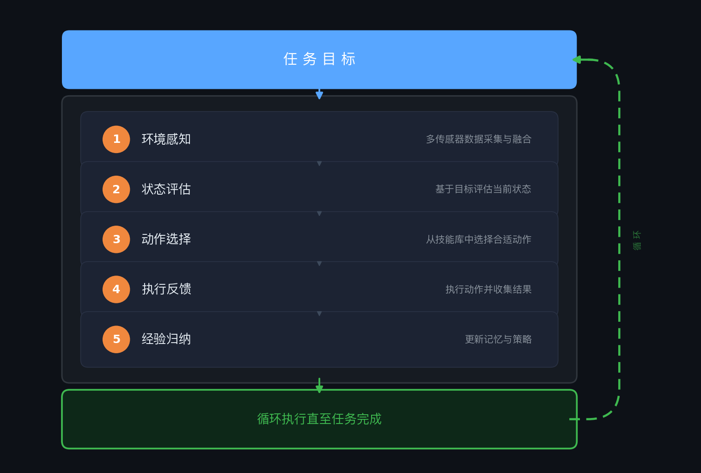

# 🦅 AerialClaw：面向通用自主无人机系统的个性化AI智能体


<p>
  
  
  
  
  
</p>

[English](README.md) | **中文**

**AerialClaw** 是一个面向通用自主无人机系统的个性化AI智能体框架。系统提供标准化的原子动作技能库（起飞、导航、感知等），由大语言模型（LLM）在任务执行中实时感知环境、规划决策并组合调用这些技能——无需为每个任务预编写完整的飞行流程，同时赋予每架无人机独立的身份认知、任务记忆与技能进化能力。

通过 Markdown 文档定义和维护智能体的认知状态与能力边界，由模型自主读写更新，实现真正的"个性化"——每架无人机都拥有属于自己的经验、偏好与成长轨迹。

> *"不预设流程，只定义能力——让每架无人机在任务中自主思考、积累经验、持续成长。"*

<p align="center">
  
</p>

---

## 📑 目录

- [📢 更新日志](#-更新日志)
- [研究背景与动机](#研究背景与动机)
- [系统架构设计](#系统架构设计)
- [决策机制](#决策机制自主循环实现)
- [技能体系](#已接入的技能体系)
- [感知系统](#感知系统)
- [安全体系](#安全体系)
- [记忆系统](#记忆系统)
- [通用设备协议](#通用设备协议)
- [自进化能力](#自进化能力)
- [仿真验证环境](#仿真验证环境)
- [Web 监控界面](#web监控界面)
- [安装与部署](#安装与部署)
- [快速开始](#快速开始)
- [项目结构](#项目结构)
- [致谢](#致谢)

---

## 📢 更新日志

- **(2026/3/15)** AerialClaw v2.0 发布 — 安全包线、四层记忆、通用设备协议、自进化引擎、混合部署。
- **(2026/3/14)** AerialClaw v1.0 发布 — 完整 Agent 决策循环、12 项硬技能、反思引擎、Web 控制台、PX4+Gazebo 仿真集成。

## 研究背景与动机

当前无人机系统大多依赖预编程脚本，缺乏对未知环境的适应能力。AerialClaw 探索通过 LLM 赋予无人机**自主理解环境与实时决策**的能力：

- 🧠 **推理而非仅执行** — LLM 解析任务目标，生成分步决策
- 👁️ **语义级环境理解** — 多源传感器数据转为自然语言，支持常识推理
- 📝 **飞行经验自积累** — 任务记忆库，基于历史经验优化决策
- 🪪 **能力边界自感知** — 维护性能档案，记录能力边界与表现

## 系统架构设计

<p align="center">
  
</p>

### 核心设计原则

1. **第一人称决策视角** — 以无人机为主体视角进行决策
2. **语义级传感器融合** — 原始传感器数据转换为 LLM 可理解的语义描述
3. **文档驱动技能定义** — 飞行动作与策略以可读文档形式存储，支持动态加载
4. **分层记忆管理机制** — 长期经验积累与短期上下文的高效平衡

## 决策机制：自主循环实现

系统采用基于实时感知的增量决策机制，每一步执行完整的认知循环：

<p align="center">
  
</p>

系统具备基础异常处理能力：路径受阻时重新规划，发现意外目标时调整注意力，电量不足时执行返航。

### 身份与状态管理系统

| 文档 | 功能描述 | 内容示例 |
|------|---------|----------|
| `SOUL.md` | 定义决策偏好与约束 | *安全优先策略，保守风险评估* |
| `BODY.md` | 记录硬件配置与性能参数 | *传感器类型，飞行性能边界* |
| `MEMORY.md` | 存储任务经验与教训 | *特定场景下的有效策略记录* |
| `SKILLS.md` | 跟踪技能执行统计数据 | *各动作的成功率与适用条件* |
| `WORLD_MAP.md` | 构建环境特征知识库 | *已知区域的地标与风险点* |

所有文档采用Markdown格式，支持版本管理与人工审阅。系统在任务前后自动读写相关文档。

### 已接入的技能体系

系统采用受人类认知结构启发的**四层技能架构**：

```
┌─────────────────────────────────────────────────────┐
│  策略层 (Soft Skills)                                │  ← 知识文档，LLM 自主组合
│  search_target, rescue_person, patrol_area           │
├─────────────────────────────────────────────────────┤
│  认知层 (Cognitive Skills)                           │  ← 信息处理能力
│  http_request, run_python, read_file, write_file     │
├─────────────────────────────────────────────────────┤
│  感知层 (Perception Skills)                          │  ← 环境感知
│  detect_object, observe, scan_area, fuse_perception  │
├─────────────────────────────────────────────────────┤
│  运动层 (Motor Skills)                               │  ← 物理动作
│  takeoff, land, fly_to, hover, return_to_launch      │
└─────────────────────────────────────────────────────┘
```

**运动技能（12 项原子动作）** — 直接控制无人机的物理动作：

| 类别 | 技能 | 说明 |
|:---|:---|:---|
| 飞行控制 | `takeoff` `land` `hover` `fly_to` `fly_relative` `change_altitude` `return_to_launch` | 起降、悬停、定点飞行、相对位移、变高、返航 |
| 环境感知 | `look_around` `detect_object` `fuse_perception` | 多方位观察、目标检测（VLM）、多传感器语义融合 |
| 状态查询 | `get_position` `get_battery` | 获取当前位置、电量状态 |
| 标记管理 | `mark_location` `get_marks` | 标记兴趣点、查询已标记位置 |

**认知技能（4 项元技能）** — 信息获取与处理能力：

| 技能 | 说明 | 安全机制 |
|:---|:---|:---|
| `run_python` | 在沙箱中执行 Python 代码 | 自适应沙箱（Docker → subprocess → 受限执行） |
| `http_request` | HTTP GET/POST 请求获取信息 | 禁止内网地址，超时保护 |
| `read_file` | 读取文件内容 | 限制在工作目录内 |
| `write_file` | 写入文件 | 限制在工作目录内，审计记录 |

认知技能赋予 Agent 超越物理动作的**信息处理能力**——例如飞行前查询天气 API，或用 Python 计算最优航路。

**软技能（场景策略文档）**：

| 策略 | 说明 |
|:---|:---|
| `search_target` | 区域搜索 — LLM 自主规划搜索路径，融合视觉与雷达判断目标 |
| `rescue_person` | 人员救援 — 发现目标后的接近、评估、标记、上报全流程 |
| `patrol_area` | 区域巡逻 — 按策略覆盖区域，持续监控异常 |

软技能以 Markdown 文档形式存储，LLM 在执行时读取文档理解策略意图，自主组合运动、认知和感知技能完成任务。系统还支持**动态生成新软技能**：当 LLM 在反思中发现重复的行为模式时，会自动提取为新的策略文档。

**能力缺口检测**：当 LLM 规划了不存在的技能时，系统在*执行前*即拦截，并将缺口分类为 `software`（可通过代码生成自动填补）或 `hardware`（需要物理硬件支持）。这种**自知的能力边界意识**防止了幻觉计划到达执行层。

### 感知系统

技能的执行离不开对环境的感知。系统采用**被动 + 主动双层感知架构**，为 LLM 的决策提供不同粒度的环境信息：

- **被动感知**（`PerceptionDaemon`）— 后台持续运行，周期性融合多传感器数据生成环境摘要，为 LLM 提供实时态势感知
- **主动感知**（`VLMAnalyzer`）— 由 LLM 按需触发，调用视觉语言模型对图像进行深度分析（目标检测、场景理解等）

感知模型支持**可插拔配置**：可接入云端 API（GPT-4o 等）、本地部署的开源模型、或自行微调的专用模型，以适应不同部署场景对延迟、精度和隐私的需求。

该设计支持研究多种应用场景：
- 🏚️ **灾害响应** — 废墟环境的人员搜救
- 🌲 **生态监测** — 森林区域的异常检测
- 🏗️ **设施巡检** — 建筑结构的安全检查
- 🌾 **农业观测** — 作物生长状态的评估

## 安全体系

AerialClaw 将安全视为**硬件级保障**，而非 LLM 层面的策略约束。每条指令经过四道顺序关卡：

```
指令 → [第1关：过滤] → [第2关：沙箱] → [第3关：审批] → [第4关：包线] → 执行
```

| 关卡 | 机制 | 说明 |
|------|------|------|
| **1. 命令过滤** | 黑白名单 | 在进入规划器前拦截禁止指令 |
| **2. 沙箱隔离** | Docker → subprocess → restricted（自动降级） | 代码执行与宿主系统完全隔离 |
| **3. 分级审批** | `auto` / `confirm` / `deny` | 操作员可对每类动作配置授权级别 |
| **4. 安全包线** | 硬编码物理限制 | LLM 无法绕过，在适配器层强制执行 |

**安全包线参数**（硬编码，LLM 不可触及）：

| 限制项 | 参数值 |
|--------|--------|
| 最大速度 | 10 m/s |
| 最大高度 | 120 m |
| 电量返航阈值 | 15% |
| 电量强制降落阈值 | 5% |
| 心跳超时 | 10 s |

**"脊髓"架构**：LLM 是大脑（可能出错）；安全包线是脊髓（硬编码反射弧）。即使 LLM 产生幻觉，也无法指挥无人机超越物理安全限制。

- **审计日志**：所有指令、决策与安全干预全程记录，可导出。
- **三档安全等级**：`strict` / `standard` / `permissive` 一键切换。

## 记忆系统

四层记忆架构在即时上下文、历史经验与语义检索之间取得平衡：

```
┌─────────────────────────────────────────────────┐
│  工作记忆 (Working)  — 当前任务上下文            │  短期，每次任务清空
├─────────────────────────────────────────────────┤
│  情节记忆 (Episodic) — 任务历史与结果            │  持久化，按相似度检索
├─────────────────────────────────────────────────┤
│  技能记忆 (Skill)    — 执行统计数据              │  成功率、失败模式记录
├─────────────────────────────────────────────────┤
│  世界知识 (World)    — 环境发现与地图特征        │  地标、危险点、已知区域
└─────────────────────────────────────────────────┘
```

- **向量语义检索** — `chromadb` 为主，`TF-IDF` 自动降级；无需外部服务
- **反思引擎** — 任务完成后：任务日志 → LLM 反思 → 更新记忆 → 指导下次规划
- **规划时检索** — 任务规划时自动检索相关历史经验注入上下文，替代全文注入以控制 token 消耗
- **跨任务经验迁移** — 某平台或场景积累的经验可泛化到相似的未来任务

## 通用设备协议

任何实现该协议的设备均可被 AerialClaw 控制，无需为基本操作编写自定义适配器。

**双通道通信**：HTTP REST（指令与注册） + WebSocket（实时遥测）

| 接口 | 方法 | 说明 |
|------|------|------|
| `/devices/register` | POST | 设备注册（携带能力声明） |
| `/devices/{id}/status` | POST | 状态上报 |
| `/devices/{id}/sensors` | POST | 传感器数据上报 |
| `/devices/{id}/command` | POST | 指令下发 |
| `/devices/{id}/heartbeat` | POST | 心跳保活（10 s 超时 → 自动 offline） |

- 所有接口均需 **Token 鉴权**
- **心跳看门狗**：10 秒未收到心跳自动置设备为离线状态
- 内置**三端客户端模板**：Python · Arduino（ESP32）· ROS2 — 详见 [`clients/README.md`](clients/README.md)

## 自进化能力

AerialClaw 在接入新设备或遭遇技能缺口时，能够自主扩展自身能力：

**设备分析器** — 新设备注册时：
1. LLM 分析设备声明的能力清单
2. 自动生成该设备专属的 `BODY.md`
3. 与现有技能库匹配，将缺口标记待生成

**代码生成器** — 针对 `software` 类缺口：
1. LLM 从零生成 Python 适配器代码
2. 在沙箱中运行，失败时自动尝试自修复
3. 成功后部署到适配器库

**技能进化器** — 持续改进技能表现：
1. 分析 `SKILLS.md` 中各技能的执行统计
2. LLM 提出优化策略，表现差的技能被淘汰
3. 新策略文档自动晋升为软技能

**能力缺口检测** — 执行前三层防线：
- `software` 缺口 → 触发代码生成流水线
- `hardware` 缺口 → 明确拒绝并说明原因，杜绝幻觉执行
- "接入新平台"本身就是一个可端到端自动运行的软技能

## 仿真验证环境

目前已在 **PX4 SITL + Gazebo Harmonic** 仿真环境中构建验证平台：

<p align="center">
  
  <br>
  <em>X500无人机在城市救援场景中的仿真测试（4倍速播放）</em>
</p>

| 组件 | 技术选型 |
|------|----------|
| 飞控系统 | PX4 v1.15 软件在环仿真 |
| 仿真环境 | Gazebo Harmonic (gz sim 8.x) |
| 传感器模型 | 5路摄像头 + 3D LiDAR (360°×16层) |
| 通信协议 | Micro XRCE-DDS + MAVSDK gRPC |
| 坐标系 | NED (北-东-地) 局部坐标系 |

**仿真场景要素**：倒塌建筑、被困人员模型、火灾烟雾效果、障碍物布置、地面标记等。

## Web监控界面

<p align="center">
  
</p>

提供研究所需的可视化与交互工具：
- 📷 **多视角视频流** — 前/后/左/右/下五路摄像头实时画面
- 📡 **激光雷达可视化** — 3D LiDAR 点云数据的多层渲染显示
- 🕹️ **手动控制模式** — 支持键盘操控的 FPV 第一人称视角
- 🤖 **AI 自主模式** — 自然语言下达任务，LLM 自主规划执行
- 💬 **指令交互界面** — 自然语言任务指令与对话式交互
- 📊 **状态监控面板** — 飞行参数与系统状态的实时显示
- ⚙️ **模型配置管理** — 支持多 LLM 后端的切换与配置

系统提供**手动 / AI 双模式实时切换**，操作员可随时从 AI 自主模式接管控制权，执行过程中支持一键打断。这是面向真实部署场景的基本安全保障——AI 负责决策，人始终拥有最终否决权。

## 安装与部署

### 环境要求

- Python >= 3.10，Node.js >= 18
- CMake >= 3.22
- Git

### 第一步：克隆仓库

```bash
git clone https://github.com/XDEI-Group/AerialClaw.git
cd AerialClaw
```

### 第二步：Python 环境

```bash
python3 -m venv venv
source venv/bin/activate
pip install -r requirements.txt
```

### 第三步：构建 Web 界面

```bash
cd ui
npm install
npm run build
cd ..
```

### 第四步：配置 LLM

```bash
cp .env.example .env
```

编辑 `.env`，填入你的 LLM 服务配置：

```bash
ACTIVE_PROVIDER=openai                    # 或 ollama_local / deepseek / moonshot
LLM_BASE_URL=https://api.openai.com/v1   # API 地址
LLM_API_KEY=sk-your-key-here              # API Key
LLM_MODEL=gpt-4o                          # 模型名称
```

支持 OpenAI、DeepSeek、Moonshot、本地 Ollama 等任何兼容 OpenAI 接口的服务。详见 [docs/LLM_CONFIG.md](docs/LLM_CONFIG.md)。

### 第五步：安装 PX4 仿真环境

一键脚本自动完成 PX4 克隆、补丁应用、自定义模型安装和编译：

```bash
./scripts/setup_px4.sh
```

该脚本会自动：
- 克隆 PX4-Autopilot 官方仓库
- 应用 AerialClaw 的参数补丁（磁力计、免遥控器模式等）
- 安装自定义无人机模型（x500_sensor：5 路摄像头 + 3D LiDAR）
- 安装自定义 Gazebo 场景（urban_rescue）
- 编译 PX4 SITL

> 首次编译约需 10-30 分钟。macOS ARM64 用户如遇问题，参见 [docs/SIMULATION_SETUP.md](docs/SIMULATION_SETUP.md)。

## 快速开始

按顺序启动四个终端：

**终端 1 — 仿真环境**
```bash
cd ../PX4-Autopilot
export CMAKE_POLICY_VERSION_MINIMUM=3.5
export PX4_GZ_WORLD=urban_rescue
make px4_sitl gz_x500
```

**终端 2 — MAVSDK 服务**
```bash
mavsdk_server -p 50051 udp://:14540
```

**终端 3 — AerialClaw 主服务**
```bash
cd AerialClaw
source venv/bin/activate
python server.py
```

**终端 4 — 浏览器访问**
```
http://localhost:5001
```

在 Web 界面中：
1. 点击「⚡ 初始化系统」
2. 右上角切换到「🤖 AI」模式
3. 输入自然语言指令测试：
   - *"起飞至15米高度并观察周围环境"*
   - *"搜索北部区域，发现目标后拍照记录"*
   - *"报告当前电量和位置"*

## 项目结构

```
AerialClaw/
├── server.py                    # 服务入口
├── config.py                    # 全局配置（从 .env 读取）
├── llm_client.py                # LLM 多 Provider 客户端
├── .env.example                 # 环境变量模板
├── requirements.txt             # Python 依赖
│
├── brain/                       # 决策核心
│   ├── agent_loop.py            #   自主决策循环
│   ├── planner_agent.py         #   LLM 任务规划器
│   └── chat_mode.py             #   对话模式
│
├── perception/                  # 感知系统
│   ├── daemon.py                #   被动感知守护线程
│   ├── vlm_analyzer.py          #   主动视觉分析（VLM）
│   ├── prompts.py               #   感知提示词
│   └── gz_camera.py             #   Gazebo 摄像头桥接
│
├── skills/                      # 技能库
│   ├── hard_skills.py           #   硬技能实现
│   ├── soft_skills.py           #   软技能执行器
│   ├── docs/                    #   硬技能文档（13 个）
│   ├── soft_docs/               #   软技能策略文档（3 个）
│   └── dynamic_skill_gen.py     #   动态技能生成
│
├── memory/                      # 记忆与学习
│   ├── reflection_engine.py     #   反思引擎
│   ├── skill_evolution.py       #   技能进化
│   ├── world_model.py           #   世界模型
│   └── task_log.py              #   任务日志
│
├── robot_profile/               # 身份文档
│   ├── SOUL.md / BODY.md        #   人格与硬件描述
│   ├── MEMORY.md / SKILLS.md    #   经验与技能自述
│   └── WORLD_MAP.md             #   环境地图
│
├── adapters/                    # 硬件适配层
│   ├── base_adapter.py          #   抽象接口
│   ├── px4_adapter.py           #   PX4 适配器
│   ├── sim_adapter.py           #   仿真适配器
│   └── mock_adapter.py          #   Mock 测试适配器
│
├── sim/                         # 仿真资源
│   ├── models/x500_sensor/      #   自定义无人机模型（5 摄像头 + LiDAR）
│   ├── worlds/urban_rescue.sdf  #   自定义 Gazebo 场景
│   ├── airframes/               #   自定义 airframe
│   └── px4_patches.diff         #   PX4 定制补丁
│
├── ui/                          # Web 监控界面（React）
│   └── src/components/          #   9 个 React 组件
│
├── scripts/                     # 脚本
│   ├── setup_px4.sh             #   一键安装 PX4 + 打补丁
│   └── start_gz_sim.sh          #   一键启动仿真
│
├── docs/                        # 开发文档
│   ├── ARCHITECTURE.md          #   系统架构
│   ├── SIMULATION_SETUP.md      #   仿真环境搭建
│   ├── ADAPTER_GUIDE.md         #   适配器接入指南
│   ├── SKILL_GUIDE.md           #   技能开发指南
│   ├── PERCEPTION_GUIDE.md      #   感知模块接入指南
│   └── LLM_CONFIG.md            #   LLM 配置说明
│
└── assets/                      # 图片与演示资源
```

## 研究进展与计划

### 已实现
- [x] 自主决策循环 · 身份与状态管理 · 12 运动技能 + 4 认知技能 + 3 软技能
- [x] 被动 + 主动双层感知 · 经验反思 · 动态技能生成 · 技能淘汰
- [x] PX4 + Gazebo 仿真 · Web 监控与交互 · 驾驶舱 FPV
- [x] 四层记忆系统 · 向量语义检索 · 跨任务经验迁移
- [x] 通用设备协议 (HTTP + WebSocket) · 三端客户端模板
- [x] 四道安全关卡 · 硬编码安全包线 · 操作审计
- [x] 自适应沙箱 · 认知技能 · 能力缺口检测
- [x] 自进化能力 · LLM 设备分析 · Adapter 自动生成
- [x] 混合部署架构 · 断网应急 · 边缘-云端协同

### 未来方向
- [ ] 真实无人机移植 · ROS2 集成 · Sim2Real 迁移
- [ ] 多智能体协作 · 共享世界模型

## 参与贡献

欢迎 Issue 和 PR。详见 [docs/](docs/) 中的开发文档。

## 开源协议

本项目采用 [MIT License](LICENSE) 开源协议。

## 致谢

项目由西安电子科技大学计算机科学与技术学院 ROBOTY 实验室开发。

研究思路受到 [OpenClaw](https://github.com/openclaw/openclaw) 项目的启发，在此表示感谢。

基于以下开源技术构建：
[PX4](https://px4.io/) · [Gazebo](https://gazebosim.org/) · [MAVSDK](https://mavsdk.mavlink.io/) · [React](https://react.dev/) · [Vite](https://vitejs.dev/)

---

*本项目为学术研究性质的开源项目，旨在探索LLM在自主移动平台中的应用潜力。*